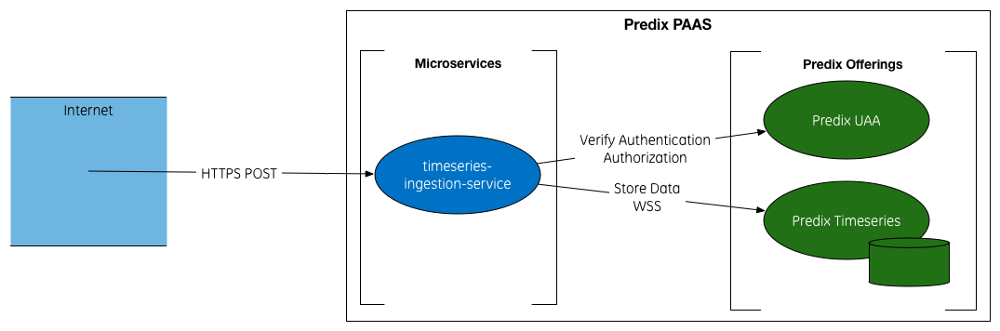

# Timeseries Ingestion Service

Python service that ingests CSV files of timeseries data into Predix Timeseries service.

## Service Flow

This service exposes an endpoint that accepts HTTP POST requests.

Based on the token sent with the request this service verifies the authentication and authorization for the user to use this service and to use the Predix Timeseries service.

After the verification, this service opens a Secure Web Sockets connection with Predix Timeseries to transfer the data from the file submitted with the request to the Predix Timeseries store.



## Deploying

Follow the steps below to deploy this service in a new environment.

### Dependencies

This service depends on the following Predix services:

- Predix UAA
- Predix Timeseries

### Clone this repo

```
git clone https://github.build.ge.com/200020939/timeseries-ingestion-service.git
```

### Configure the service

To configure the service to your environment, edit the file manifest.yml to add the following information:
- name: change "timeseries-ingestion-service" to the name you want to use for this service.
- CLIENT_ID: the client id with access to your UAA instance, with access to the scope timeseries-ingestion-service.user and with access to your Predix Timeseries instance.
- CLIENT_SECRET: the client id and secret encoded using base64 in the form of clientID:clientPassword
- services: change "predix_uaa" to your Predix UAA service instance name, change "predix_timeseries" to your Predix Timeseries service instance name.

It's recommended to create a different manifest file for different spaces/deployment environments.

### Deploy

Push the service using the cf tool

```
cf push -f manifest.yml
```


## Using

Send a post request to the endpoint /upload.

The request must have the Authorization header with the bearer token for a user with access to Predix Timeseries ingestion service.

The request body must be a form-data with the following fields:

- file(s) - the CSV file(s) to be ingested. You can send more than one file in the same request.
- metername - the metername where the data will be saved.
- delimiter - the delimiter char used in the csv file.
- timestamp - the timestamp format used in the csv file. https://docs.python.org/2/library/datetime.html#strftime-and-strptime-behavior
- packetsize - the size of the packets to be sent. Maximum is 5000.
- equipment_index - the equipment name row index in the csv file.
- tagname_index- the source tag name row index in the csv file.
- timestamp_index - the timestamp row index in the csv file.
- value_index - the value row index in the csv file.
- metername_index - the meter name row index in the csv file.
- concat - the char to used for concatenating the equipment name and tag name.